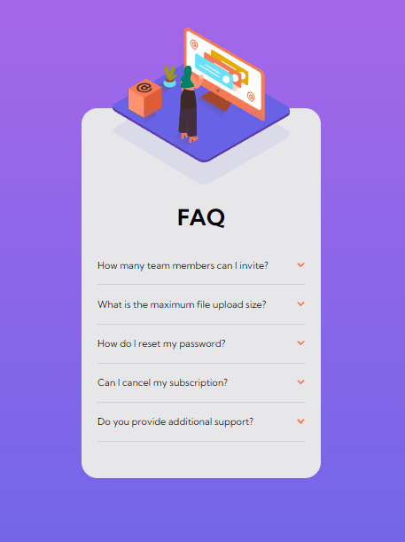

# Frontend Mentor - FAQ accordion card solution

This is a solution to the [FAQ accordion card challenge on Frontend Mentor](https://www.frontendmentor.io/challenges/faq-accordion-card-XlyjD0Oam). Frontend Mentor challenges help you improve your coding skills by building realistic projects.

## Table of contents

- [Overview](#overview)
  - [The challenge](#the-challenge)
  - [Screenshot](#screenshot)
  - [Links](#links)
- [My process](#my-process)
  - [Built with](#built-with)
  - [What I learned](#what-i-learned)
  - [Continued development](#continued-development)
  - [Useful resources](#useful-resources)
- [Author](#author)
- [Acknowledgments](#acknowledgments)

## Overview

### The challenge

Users should be able to:

- View the optimal layout for the component depending on their device's screen size
- See hover states for all interactive elements on the page
- Hide/Show the answer to a question when the question is clicked

### Screenshot

### Links

- Solution URL: https://github.com/paul-dont/faq-accordion-card
- Live Site URL: https://boisterous-figolla-e14da5.netlify.app

## My process

I started by defining the markup for the card then i styled it using a mobile first approach and fixed responsivenes right after and lastly added the functionality for the buttons.

### Built with

- Semantic HTML5 markup
- CSS custom properties
- Flexbox
- Mobile-first workflow
- Vanilla JavaScript

### What I learned

Stacking images on top of one another multiple times is quite tricky to manage and display correctly especially when responsive design comes to play. Also overflow has complications with fixed / absolute positioned elements.

### Continued development

The desktop design images need a small adjacement.

### Useful resources

## Author

- Frontend Mentor - https://www.frontendmentor.io/profile/paul-dont
- GitHub - https://github.com/paul-dont
